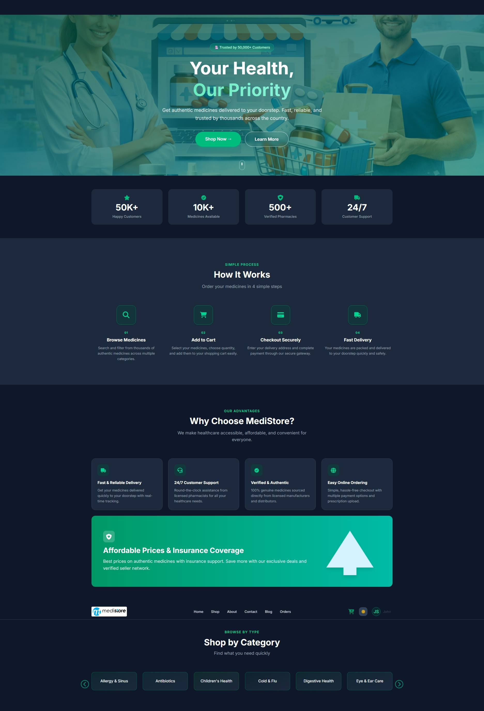
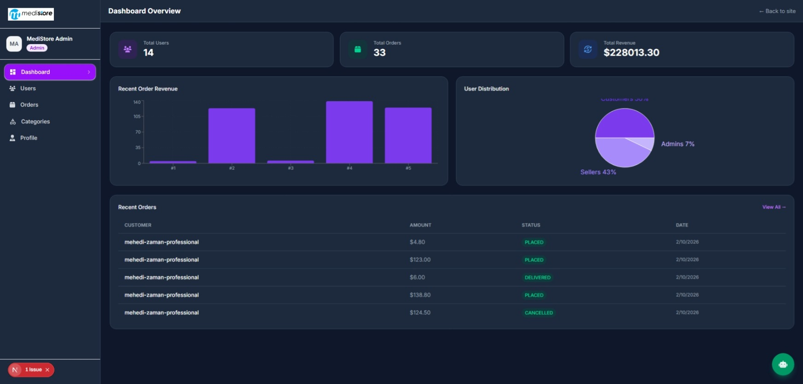

# MediStore Frontend

A comprehensive online pharmacy platform built with Next.js, featuring role-based authentication, multi-seller marketplace, order management, and review systems.

## Live Demo

**Production URL**: https://medistore-frontend.vercel.app

## Screenshots

### Home Page


### Dashboard


## Overview

MediStore is a modern e-commerce platform specifically designed for pharmaceutical products. It connects customers with verified sellers, providing a secure and convenient way to purchase medicines online. The platform features a sophisticated multi-seller order system, comprehensive admin dashboard, and seller management tools.

## Key Features

### Multi-Role System
- **Customer Portal**: Browse medicines, manage cart, place orders, track deliveries, write reviews
- **Seller Dashboard**: Manage inventory, process orders, track sales analytics, handle customer inquiries
- **Admin Panel**: User management, order oversight, category management, system analytics

### Advanced Order Management
- **Multi-Seller Order Splitting**: Orders from multiple sellers are automatically split into independent sub-orders
- **Independent Status Tracking**: Each seller manages their portion independently without conflicts
- **Real-time Order Updates**: Customers can track each seller's delivery status separately
- **Comprehensive Order History**: Complete order tracking with detailed breakdowns

### Medicine Catalog
- **Advanced Search & Filtering**: Search by name, category, price range, seller
- **Detailed Product Pages**: Complete medicine information, dosage, side effects, reviews
- **Category Management**: Organized medicine categories for easy browsing
- **Inventory Tracking**: Real-time stock management for sellers

### Review & Rating System
- **5-Star Rating System**: Customer feedback on medicines and sellers
- **Detailed Reviews**: Text reviews with purchase verification
- **Average Rating Display**: Aggregate ratings for informed purchasing decisions
- **Review Management**: Moderation tools for quality control

### Error Handling & User Experience
- **Custom 404 Page**: Branded not-found page with navigation options
- **Global Error Boundary**: Graceful error handling with recovery options
- **Loading States**: Consistent loading indicators across the application
- **Toast Notifications**: Real-time feedback for user actions
- **Responsive Design**: Mobile-first approach with seamless cross-device experience

### Security & Authentication
- **Role-Based Access Control**: Granular permissions for different user types
- **Secure Session Management**: HTTP-only cookies for authentication
- **Input Validation**: Comprehensive form validation and sanitization

## Technology Stack

### Frontend
- **Framework**: Next.js 16.1.5 (App Router)
- **Language**: TypeScript
- **Styling**: Tailwind CSS 4
- **State Management**: Zustand
- **Form Handling**: React Hook Form + Zod validation
- **HTTP Client**: Axios
- **Animations**: Framer Motion
- **Icons**: React Icons, Lucide React
- **Notifications**: React Hot Toast

### Development Tools
- **Package Manager**: npm
- **Linting**: ESLint
- **Type Checking**: TypeScript 5
- **Build Tool**: Next.js built-in bundler
- **Deployment**: Vercel

## Project Structure

```
MediStoreFrontend/
├── app/                          # Next.js App Router pages
│   ├── admin/                    # Admin dashboard & management
│   │   ├── categories/           # Category management
│   │   ├── orders/               # Order management
│   │   ├── users/                # User management
│   │   └── page.tsx              # Admin dashboard
│   ├── about/                    # About page
│   ├── cart/                     # Shopping cart
│   ├── checkout/                 # Order checkout process
│   ├── login/                    # User authentication
│   ├── orders/                   # Customer order history
│   │   └── [id]/                 # Order details
│   ├── privacy/                  # Privacy policy
│   ├── profile/                  # User profile management
│   ├── register/                 # User registration
│   ├── seller/                   # Seller dashboard & tools
│   │   ├── dashboard/            # Seller analytics
│   │   ├── medicines/            # Medicine management
│   │   └── orders/               # Seller order management
│   ├── shop/                     # Medicine catalog
│   │   └── [id]/                 # Medicine details
│   ├── error.tsx                 # Global error boundary
│   ├── loading.tsx               # Global loading component
│   ├── not-found.tsx             # Custom 404 page
│   ├── favicon.ico               # Custom favicon
│   ├── globals.css               # Global styles
│   ├── layout.tsx                # Root layout
│   └── page.tsx                  # Home page
├── components/                   # Reusable components
│   ├── home-sections/            # Home page sections
│   ├── AuthProvider.tsx          # Authentication context
│   ├── Footer.tsx                # Site footer
│   ├── Navbar.tsx                # Navigation bar
│   ├── ProtectedRoute.tsx        # Route protection
│   └── Toast.tsx                 # Notification component
├── data/                         # Static data
│   └── testimonials.ts           # Customer testimonials
├── lib/                          # Utilities & configurations
│   ├── api.ts                    # Axios configuration
│   ├── category-validation.ts    # Category form validation
│   ├── checkout-validation.ts    # Checkout form validation
│   ├── medicine-validation.ts    # Medicine form validation
│   ├── review-validation.ts      # Review form validation
│   └── validations.ts            # Auth form validation
├── public/                       # Static assets
│   ├── animation/                # Lottie animations
│   ├── Medi-Store.png           # Logo
│   ├── Medi-Store-fav.png       # Favicon
│   └── [other images]           # Various UI images
├── store/                        # State management
│   ├── authStore.ts              # Authentication state
│   └── cartStore.ts              # Shopping cart state
├── types/                        # TypeScript definitions
│   ├── admin.ts                  # Admin-related types
│   ├── api.ts                    # API response types
│   ├── orders.ts                 # Order-related types
│   └── seller.ts                 # Seller-related types
└── package.json                  # Dependencies & scripts
```

## Getting Started

### Prerequisites
- Node.js 18+ installed
- npm or yarn package manager
- Backend API server running (MediStore Backend)

### Installation

1. Clone the repository:
```bash
git clone <repository-url>
cd MediStoreFrontend
```

2. Install dependencies:
```bash
npm install
```

3. Set up environment variables:
```bash
cp .env.example .env.local
```

Edit `.env.local` with your configuration:
```env
NEXT_PUBLIC_API_URL=http://localhost:3000
```

4. Start the development server:
```bash
npm run dev
```

5. Open [http://localhost:4000](http://localhost:4000) in your browser

### Available Scripts

```bash
npm run dev      # Start development server on port 4000
npm run build    # Build for production
npm run start    # Start production server
npm run lint     # Run ESLint
```

## Core Functionality

### Authentication Flow
1. **Registration**: Users select role (Customer/Seller) and provide details
2. **Email Verification**: Account activation via email link
3. **Login**: Role-based redirection to appropriate dashboard
4. **Session Management**: Secure cookie-based authentication

### Order Processing
1. **Cart Management**: Add/remove items, quantity updates
2. **Checkout**: Shipping information, payment details
3. **Order Splitting**: Multi-seller orders automatically split
4. **Status Tracking**: Independent seller status management
5. **Delivery Updates**: Real-time status notifications

### Seller Operations
1. **Inventory Management**: Add/edit/delete medicines
2. **Order Processing**: View and update order statuses
3. **Analytics Dashboard**: Sales metrics, revenue tracking
4. **Profile Management**: Business information updates

### Admin Controls
1. **User Management**: View, activate, deactivate users
2. **Order Oversight**: Monitor all platform orders
3. **Category Management**: Create and manage medicine categories
4. **System Analytics**: Platform-wide metrics and insights


```

## Deployment

### Production Build
```bash
npm run build
```

### Vercel Deployment
```bash
vercel --prod
```

The application is automatically deployed to Vercel with:
- Automatic SSL certificates
- Global CDN distribution
- Serverless functions
- Environment variable management

## Error Handling & User Experience

### Custom Error Pages
- **404 Not Found**: Branded error page with navigation back to home or shop
- **Global Error Boundary**: Catches JavaScript errors and provides recovery options
- **Loading States**: Consistent loading spinners and skeleton screens

### Error Recovery
- **Try Again**: Users can retry failed operations
- **Navigation Options**: Clear paths back to working sections
- **Error Logging**: Automatic error reporting for debugging

## Performance Optimizations

- **Error Boundaries**: Global error handling with graceful fallbacks
- **Loading States**: Optimized loading indicators and skeleton screens
- **Server Components**: Reduced client-side JavaScript
- **Image Optimization**: Next.js automatic image optimization
- **Code Splitting**: Route-based code splitting
- **Lazy Loading**: Component-level lazy loading
- **Caching**: Built-in Next.js caching strategies

## Security Features

- **Input Validation**: All user inputs validated client and server-side
- **XSS Prevention**: Sanitized user content
- **CSRF Protection**: Token-based protection
- **Secure Authentication**: HTTP-only cookies
- **Role-Based Access**: Server-side

## Browser Support

- Chrome 90+
- Firefox 88+
- Safari 14+
- Edge 90+